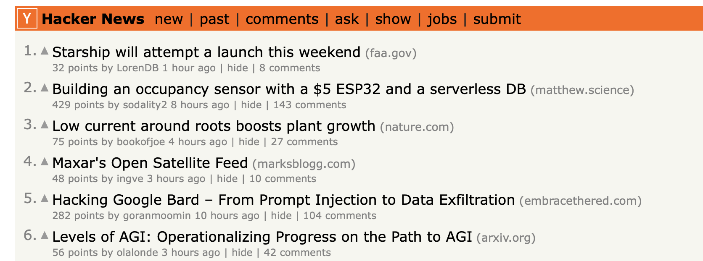
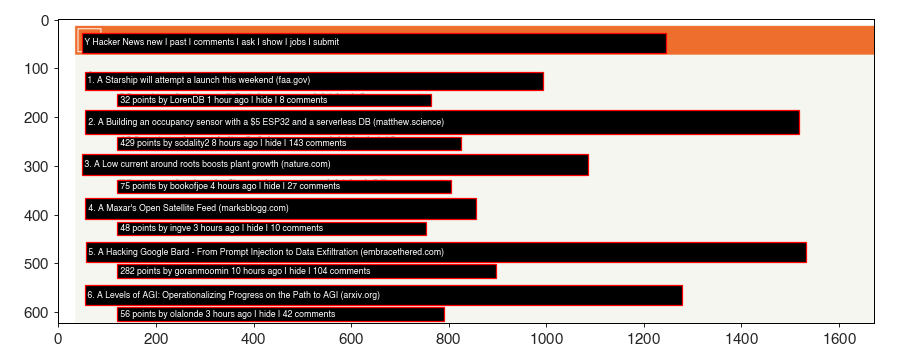

## vision OCR Python bindings

* The core parts of the code are taken directly from this very nice blog post:
https://yasoob.me/posts/how-to-use-vision-framework-via-pyobjc/
which describes how to tap into the Vision framework (not to be confused with Vision OS/Pro) via
Python to perform OCR.

* At some point make this into a package if I find a use case.

* Docs: https://developer.apple.com/documentation/vision/vnimagerequesthandler and ChatGPT


### Installation

```
python3 -m venv myenv
source myenv/bin/activate
pip install -U pip
pip install -r requirements.txt
```

> [!IMPORTANT]
> The key requirements are `pip install pyobjc-framework-Vision` and a Mac.

### Example

* Input



* Output

```python
{
    'image_width': 1672.0,
    'image_height': 622.0,
    'entities': [
        {'text': 'Y Hacker News new I past | comments | ask | show | jobs | submit', 'confidence': 1.0, 'xmin': 41.8, 'ymin': 552.889, 'xmax': 1247.033, 'ymax': 601.267},
        {'text': '1. A Starship will attempt a launch this weekend (faa.gov)', 'confidence': 1.0, 'xmin': 54.437, 'ymin': 476.867, 'xmax': 992.831, 'ymax': 513.15},
        {'text': '32 points by LorenDB 1 hour ago | hide | 8 comments', 'confidence': 1.0, 'xmin': 121.836, 'ymin': 443.0, 'xmax': 764.713, 'ymax': 469.092},
        {'text': '2. A Building an occupancy sensor with a $5 ESP32 and a serverless DB (matthew.science)', 'confidence': 1.0, 'xmin': 55.733, 'ymin': 387.0, 'xmax': 1518.733, 'ymax': 435.4},
        {'text': '429 points by sodality2 8 hours ago | hide | 143 comments', 'confidence': 1.0, 'xmin': 121.836, 'ymin': 355.0, 'xmax': 826.927, 'ymax': 381.0},
        {'text': '3. A Low current around roots boosts plant growth (nature.com)', 'confidence': 1.0, 'xmin': 48.767, 'ymin': 304.0, 'xmax': 1086.8, 'ymax': 346.0},
        {'text': '75 points by bookofjoe 4 hours ago | hide | 27 comments', 'confidence': 1.0, 'xmin': 121.836, 'ymin': 266.942, 'xmax': 806.189, 'ymax': 293.0},
        {'text': "4. A Maxar's Open Satellite Feed (marksblogg.com)", 'confidence': 0.5, 'xmin': 55.733, 'ymin': 214.0, 'xmax': 849.933, 'ymax': 256.0},
        {'text': '48 points by ingve 3 hours ago | hide | 10 comments', 'confidence': 1.0, 'xmin': 121.836, 'ymin': 178.825, 'xmax': 754.344, 'ymax': 207.333},
        {'text': '5. A Hacking Google Bard - From Prompt Injection to Data Exfiltration (embracethered.com)', 'confidence': 1.0, 'xmin': 57.029, 'ymin': 124.0, 'xmax': 1532.019, 'ymax': 166.0},
        {'text': '282 points by goranmoomin 10 hours ago | hide | 104 comments', 'confidence': 1.0, 'xmin': 121.836, 'ymin': 90.708, 'xmax': 896.918, 'ymax': 119.217},
        {'text': '6. A Levels of AGI: Operationalizing Progress on the Path to AGI (arxiv.org)', 'confidence': 1.0, 'xmin': 54.437, 'ymin': 36.0, 'xmax': 1277.978, 'ymax': 78.0},
        {'text': '56 points by olalonde 3 hours ago | hide | 42 comments', 'confidence': 1.0, 'xmin': 121.836, 'ymin': 2.592, 'xmax': 790.636, 'ymax': 31.1}
    ]
}
```

### API

```python
from ocr import extract_text

# From a file
fname = "assets/example1_input.png"
print(extract_text(fname))

# From a numpy array
from PIL import Image
array = np.array(Image.open(fname))
print(extract_text(array))

# From bytes
with open(fname, "rb") as fh:
    print(extract_text(fh.read()))

# From clipboard
print(extract_text("clipboard"))
```


### Annotating images

```python
import numpy as np
from PIL import Image
import matplotlib.pyplot as plt

from ocr import extract_text

fname = "assets/example1_input.png"

img = np.array(Image.open(fname))
output = extract_text(img, method="accurate", origin="top")
entities = output["entities"]

height, width = img.shape[:2]

fig, ax = plt.subplots(figsize=(10,4))
ax.imshow(img)

for entity in entities:
    xmin, xmax = entity["xmin"], entity["xmax"]
    ymin, ymax = entity["ymin"], entity["ymax"]
    text = entity["text"]

    print(entity)

    if abs(entity["rotation_degrees"]) < 5:
        rect = plt.Rectangle(
            (int(xmin), int(ymin)), xmax - xmin, ymax - ymin, ec="red", fc=(0, 0, 0, 0.9)
        )
        ax.add_patch(rect)
    else:
        import matplotlib.patches as patches

        # Assuming you have these coordinates for the corners
        # Replace these with your actual values
        topLeft = entity["polygon"]["top_left"]
        topRight = entity["polygon"]["top_right"]
        bottomRight = entity["polygon"]["bottom_right"]
        bottomLeft = entity["polygon"]["bottom_left"]

        # Create a polygon patch with the coordinates of the rotated rectangle
        polygon = patches.Polygon([topLeft, topRight, bottomRight, bottomLeft], closed=True, fill=False, edgecolor='red')
        ax.add_patch(polygon)

    ax.annotate(
        " " + text,
        (xmin, (ymin + ymax) // 2),
        color="w",
        fontsize=7,
        ha="left",
        va="center",
    )

fig.set_tight_layout(True)
fig.savefig("assets/example1_annotated.png")
```




### CLI
```bash
function vcopy() {
    python -c 'import ocr, json; print(json.dumps(ocr.extract_text("clipboard")))' | jq -r '.entities[].text' | tee >(pbcopy)
}


function tcopy() {
    # if one argument provided, it's the method
    # see `tesseract --help-extra`. 4 and 6 work
    # if the default (no argument) doesn't format
    # the columns correctly
    if [ $# -lt 1 ]; then
        extra=""
    else
        extra="--psm $1"
    fi
    screencapture -i -o /tmp/temp.png
    tesseract $extra /tmp/temp.png - | tee >(pbcopy)
}
```
